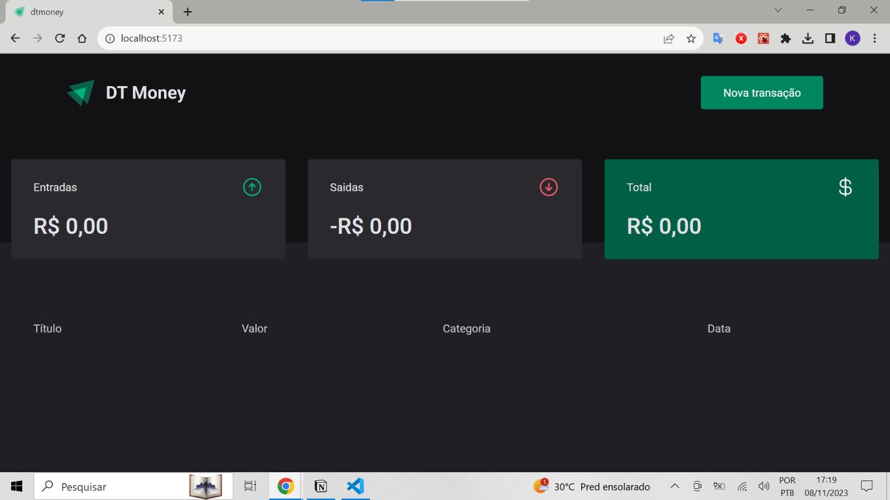
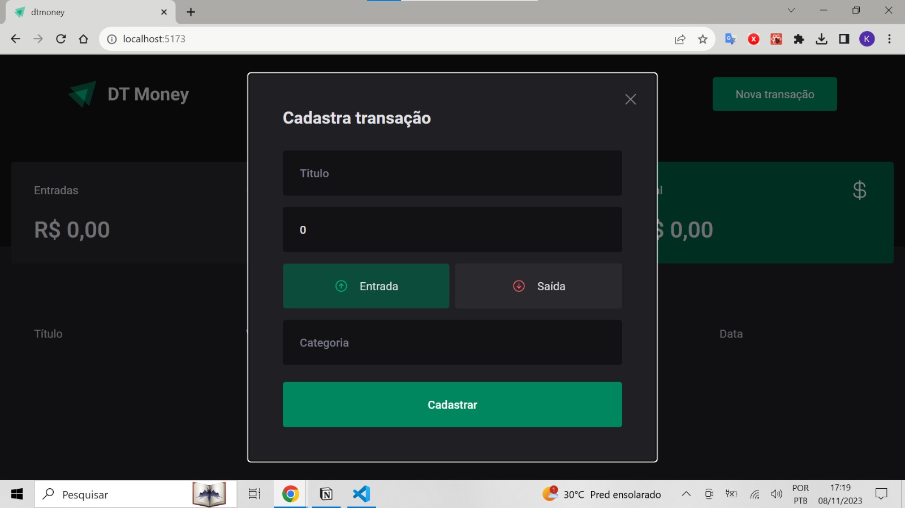
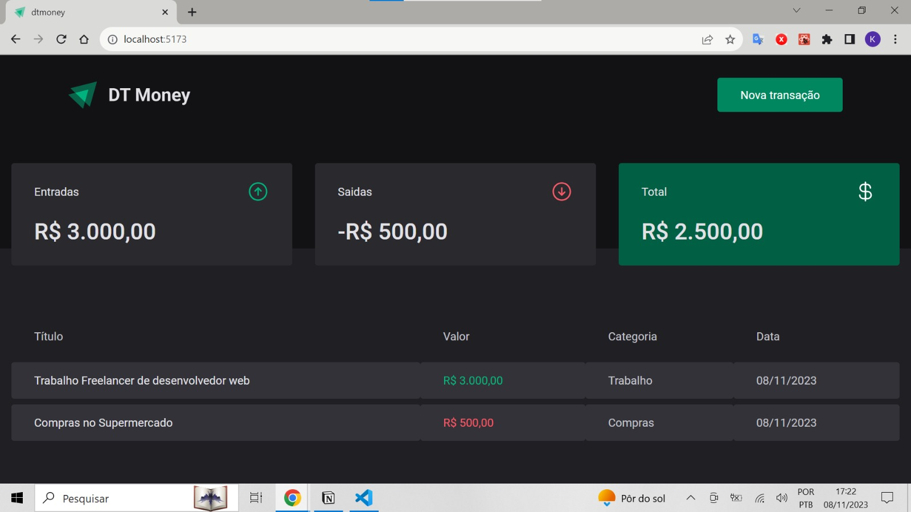

# 🌠Ignite DT Money - React.js Project 🌠

## Sobre o projeto

dtmoney é um projeto de Gestão Financeira construido com ReactJS, onde você pode cadastrar sua renda de acordo com o que você recebeu e gastou, e ver o saldo total de suas transações.

### Tecnologias utilizadas

- ReactJS (v18.2.0)
- Typescript (v5.0.2)
- Vite (v4.4.5) - Server Performance
- Axios (v1.5.1) - Client HTTP
- React Hook Form (v7.46.2) - State forms
- Styled-components (v6.1.1)

### No projeto é possivel

- Cadastrar rendas de depositos
- Cadastrar rendas de retiradas
- Ver a renda total de depositos de retiradas
- Ver historico de depositos de retiradas ao longo do tempo

### Layouts do projeto





### Executar o projeto na propria maquina

### Pré-requisitos

Certifique-se de que você tenha o Node.js (v18.16.1) e o Yarn(v1.22.19) instalados em sua máquina. Você pode verificar a instalação executando os seguintes comandos no terminal:

```bash
node -v
yarn -v

```

```bash
# clonar repositório
git clone https://github.com/kevenklynsman/DT-Money-ReactJS.git

# entrar na pasta do projeto front end web
cd (caminho-para-o-seu-projeto)

# instalar dependências
npm install / yarn install

# executar o projeto
npm run dev / yarn run dev

```
